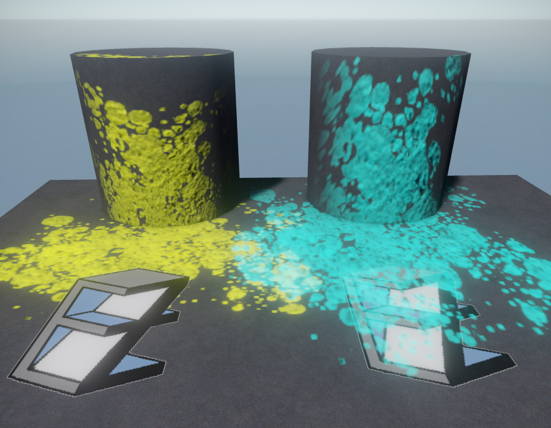

# Decals

*Decals* are textures that are projected onto the underlying geometry. Decals can be used to to apply text and other signs to geometry. The most common use-case, though, is to make scenes look more natural by simulating wear and tear, such as dirt and scratches. Decals can also be used to simulate dynamic surface imperfections like bullet holes, soot and blood spatters.

## Decal Asset

Before being able to place a *decal component*, you must create a decal [asset](../assets/assets-overview.md).

### Decal Asset Properties

**Mode:** The mode specifies which surface properties (color, normal, occlusion/roughness/normal) the decal will affect. If the mode is set to *BaseColor* only, it will change the geometry's underlying color, but nothing else. If it is set to *BaseColor, Normal*, it will also modify the surface's normal, etc.

**BlendModeColorize:** If this is disabled, the decal's color texture will be applied 1:1 and the decal's alpha channel specifies the blend factor. If *BlendModeColorize* is true, the decal's color texture is used to 'change' the color of the underlying geometry, but not 'overwrite' it. A middle-grey value in the decal color texture means the decal will *not* change the underlying geometry color, at all. A darker value will darken the underlying geometry and a lighter value will lighten up the underlying color.

This mode is useful for decals that should always darken or brighten the underlying geometry slightly, instead of overwriting the existing color and thus resulting in some fixed brightness.

**AlphaMask:** An optional separate texture to specify the decal's alpha channel. If this is not specified, the decal's opacity is taken from the alpha channel of the *Base Color* texture. This can be used to combine a dedicated grey-scale texture to specify the decal's shape, and combine it with some arbitrary texture to specify the color pattern. **Note:** If an *AlphaMask* texture is given, all other textures are resized to be no larger than this.

**Base Color:** The texture that defines the decal's color. If no separate *AlphaMask* texture is given, the alpha channel of this texture will also define the shape of the decal.

**Normal, ORM, Emissive:** If the respective *Mode* is selected, these settings show up for you to specify which textures to use to modify the *normal* and/or *occlusion/roughness/metalness*. If the mode is *BaseColor, Emissive*, a dedicated *Emissive* texture can be used to specify which pixels will glow with which color, though in that case you cannot overwrite the normal or ORM values.

## Decal Component

Each *decal component* represents a single instance of a decal. Its position, rotation and scale define where the decal appears.

### Decal Component Properties

**Decals:** An array of decal asset references. When the game starts, a random decal from this list is chosen for display.

**ProjectionAxis:** The axis along which to project the decal.

**Extents:** The size of the decal along each axis.

**SizeVariance:** If this value is non-zero, the decal's *Extents* will be randomized between `Extents - Extents*Variance` and `Extents + Extents*Variance` using a Normal Distribution. See [Variance Values](particle-effects/particle-effects-overview.md#variance-values).

**Color:** A tint color for the decal.

**EmissiveColor:** If set to anything other than black, the decal will glow with this color.

**SortOrder:** A float value to adjust whether this decal will appear before or behind other decals. Default is zero. Decals with higher values will be rendered on top of decals with lower values. In the screenshot above, the left `EZ` decal uses a positive *sort order*, the right one uses a negative *sort order*.

**WrapAround:** If disabled, the decal is simply projected onto the geometry along the selected axis. This can result in visible stretching along orthogonal axes. When *WrapAround* is enabled, the depth along the projection axis is used to modify the decal's UV coordinates. This trades less stretching, for other distortions. Enabling *WrapAround* may be useful for 'organic' decals, such as dirt and fluid spatters. For 'mechanical' decals, such as road signs, it should be disabled. In the screenshot above, the left (yellow) decal uses *WrapAround*, the right (turquoise) one does not.

**MapNormalToGeometry:** If enabled, the normal of the decal is considered to be relative to the normal of the underlying geometry. Thus it will 'adjust' the normal of the geometry and the direction from where the decal is projected has no influence on the final pixel normal. This is useful for decals that should act like a layer on top of some geometry, for example fluids and scratches.
If disabled, the decal will completely overwrite the normal of the underlying geometry and thus the direction from where the decal is projected has a significant influence. This is useful for decals that should show exactly from where they were projected, for example bullet holes.

**InnerFadeAngle, OuterFadeAngle:** When a decal is projected onto geometry at an angle (not straight down), the *inner fade angle* specifies at what angle the decal starts to fade out and the *outer fade angle* specifies at what angle the decal will be completely invisible.

**FadeOutDelay, FadeOutDuration:** If these are non-zero, the decal will fade out over *FadeOutDuration* seconds starting after *FadeOutDelay* seconds.

**OnFinishedAction:** If the decal component is set to fade out, it may delete itself or its entire owner object afterwards.

**ApplyToDynamic:** By default, decals apply to *static geometry* but not to *dynamic geometry*. If it is desired for a decal to be projected onto a dynamic object, this property should be used to select exactly to which dynamic object the decal should be applied to. Note that decals can only be applied to a single dynamic game object. If the selected object turns out to be *static*, though, the decal will be invisible.

## See Also

* [Particle Effects](particle-effects/particle-effects-overview.md)
* [Back to Index](../index.md)
