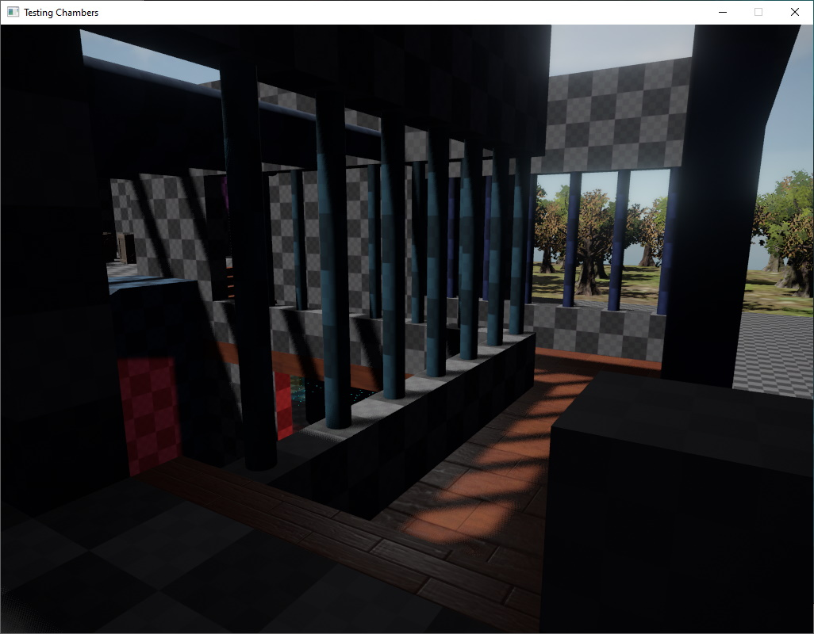

# Screenshots

For tutorial videos, [have a look here](../docsrc/getting-started/videos.md).

## Samples

## Tools

## UI

## Skeletal Animations

<video src="../docsrc/animation/media/anim-point-shoot.webm" width="500" height="500" autoplay loop></video>

<video src="../docsrc/animation/media/anim-clip.webm" width="800" height="600" autoplay loop></video>

## Particle Effects

<video src="../docsrc/effects/particle-effects/media/color-gradient.webm" width="500" height="500" autoplay loop></video>

<video src="../docsrc/effects/particle-effects/media/flies.webm" width="500" height="500" autoplay loop></video>

<video src="../docsrc/effects/particle-effects/media/size-curve.webm" width="500" height="500" autoplay loop></video>

<video src="../docsrc/effects/particle-effects/media/event-reaction-effect.webm" width="500" height="500" autoplay loop></video>

<video src="../docsrc/effects/particle-effects/media/trail-renderer.webm" width="500" height="500" autoplay loop></video>

<video src="../docsrc/effects/particle-effects/media/effect-renderer.webm" width="500" height="500" autoplay loop></video>

## Physics

<video src="../docsrc/physics/joints/media/fixed-joint.webm" width="600" height="600" autoplay loop></video>

<video src="../docsrc/physics/joints/media/revolute-joint.webm" width="600" height="600" autoplay loop></video>

<video src="../docsrc/physics/special/media/cc.webm" width="600" height="600" autoplay loop></video>

<video src="../docsrc/physics/special/media/grab-items.webm" width="600" height="600" autoplay loop></video>

## Terrain

## Vegetation

<video src="KrautWind.webm" width="500" height="500" autoplay loop></video>

## Decals

## AI

## Other

<video src="PlayerHealth.mp4" width="800" autoplay loop></video>